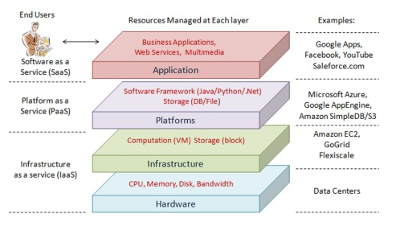

# Awesome Cloud Computing 

A curated list of amazingly awesome resources for cloud computing.

## What is Cloud Computing?

    

> Cloud computing is an internet-based computing model for enabling ubiquitous, convenient, 
> on-demand network access to a shared pool of configurable computing 
> resources (e.g., networks, servers, storage, applications and services) that can 
> be rapidly provisioned and released with minimal management effort.
> 
> It is a model for enabling ubiquitous, on-demand access to a shared pool of configurable computing resources.
> 
> It relies on sharing of resources to achieve coherence and economies of scale, similar to a utility (like the electricity grid) over a network.

## Where to Start?

## Platforms
1. [Amazon Web Services](https://aws.amazon.com)
2. [Google Cloud Platform](https://cloud.google.com/)
3. [Heroku](https://www.heroku.com)
4. [Digital Ocean](https://www.digitalocean.com)

## Cloud Computing Models
1. Software as a Service (SaaS)
2. Platform as a Service (PaaS)
3. Infrastructure as a Service (IaaS)
- [Detailed Articles](https://en.wikipedia.org/wiki/Cloud_computing#Service_models)

## Cloud Computing Deployment Types
1. Open Clouds
2. Hybrid Clouds
3. Private Clouds
- [Detailed Articles](https://en.wikipedia.org/wiki/Cloud_computing#Deployment_models)
## Tools

### Monitoring
1. [Riemann](http://riemann.io/) - Monitors distributed systems.

## Resources

## Security

## Key Concepts

### Consensus Protocols
1. [Paxos Made Live](http://static.googleusercontent.com/media/research.google.com/en//archive/paxos_made_live.pdf)
2. [ZooKeeper Consensus](http://diyhpl.us/~bryan/papers2/distributed/distributed-systems/zab.totally-ordered-broadcast-protocol.2008.pdf)
3. [Raft](https://ramcloud.atlassian.net/wiki/download/attachments/6586375/raft.pdf)

### Consistency

### Conflict-Free Data Structures

### Distributed Programming

## Distributed Systems in the Wild
1. [Bitcoin](https://bitcoin.org/bitcoin.pdf)

## Books
1. [Kubernetes: Up and Running](http://www.amazon.com/Kubernetes-Running-Dive-Future-Infrastructure/dp/1491935677)
2. [Docker: Up & Running](http://www.amazon.com/Docker-Up-Running-Karl-Matthias/dp/1491917571)
3. [Building Microservices](http://www.amazon.com/Building-Microservices-Sam-Newman/dp/1491950358)

## Presentations

## Conferences
1. [Container Camp](https://container.camp/)
2. [Kubecon](https://kubecon.io/)
3. [dotScale](https://www.dotscale.io/)
4. [docker](https://2018.dockercon.com/)

## Other Awesome Lists
1. [Awesome Docker](https://github.com/veggiemonk/awesome-docker)
2. [Awesome Kubernetes](https://github.com/ramitsurana/awesome-kubernetes)
